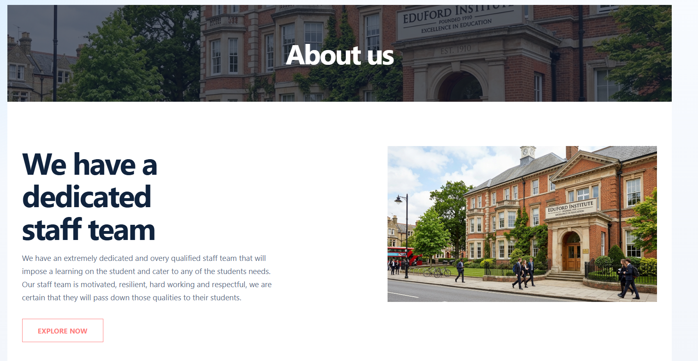
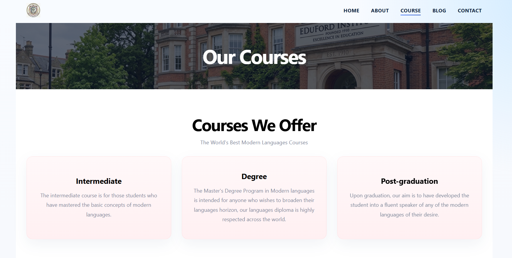
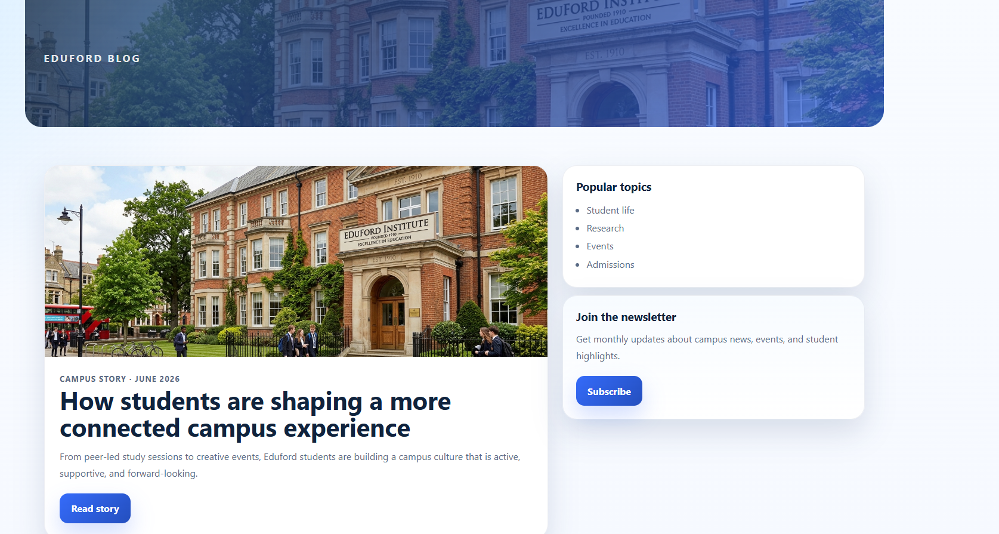
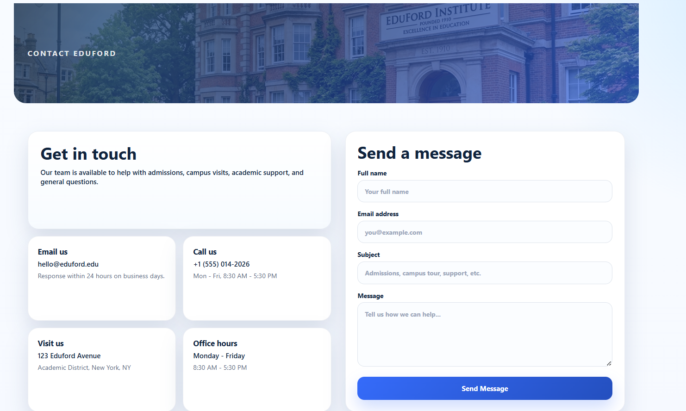

# Eduford Landing Page

A responsive multi-page Eduford website built for the Dev Community Fellowship assignment using only HTML and CSS.

## Overview

This project recreates the Eduford university-style landing page and includes separate pages for:

- Home / Landing
- About
- Courses
- Blog
- Contact

The design uses a clean blue theme, large hero sections, card-based content blocks, and responsive layouts for desktop and mobile screens.

## Features

- Fully static website built with HTML and CSS
- Responsive layout for different screen sizes
- Shared navigation across all pages
- Hero banner with branding and call-to-action on the landing page
- Dedicated pages for About, Courses, Blog, and Contact
- Styled sections for course cards, blog posts, and contact form content
- Local image assets used for campus and facility visuals

## Pages Included

- `landing.html` - Main homepage with hero section, courses, campus locations, and facilities
- `about.html` - About page with team-focused content and visual section
- `course.html` - Courses page with course cards and facilities section
- `blog.html` - Blog page with featured article and post cards
- `contact.html` - Contact page with contact details and message form layout

## Screenshots

The following screenshots document the final pages of the website:

### Landing Page


### About Page



### Courses Page



### Blog Page



### Contact Page



## Project Structure

```text
Task_1_Eduford_Landing_Page/
├── assets/
│   ├── logo.png
│   ├── eduford.png
│   ├── landing.png
│   ├── about_us.png
│   ├── courses.png
│   ├── blog.png
│   ├── contact.png
│   ├── london.jpg
│   ├── new_york.jpg
│   ├── washington.jpg
│   ├── library.jpg
│   ├── basketball.png
│   └── food.png
├── landing.html
├── landing.css
├── about.html
├── about.css
├── course.html
├── course.css
├── blog.html
├── blog.css
├── contact.html
├── contact.css
└── README.md
```

## How to Run

1. Open the `Task_1_Eduford_Landing_Page` folder in VS Code.
2. Open `landing.html` in your browser.
3. Use the navigation bar to move between pages.

You can also use the VS Code Live Server extension if you want automatic refresh while editing.
