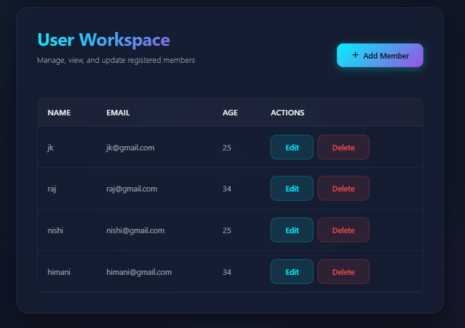
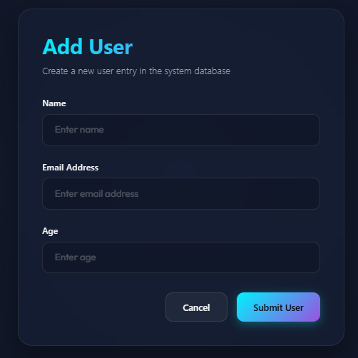
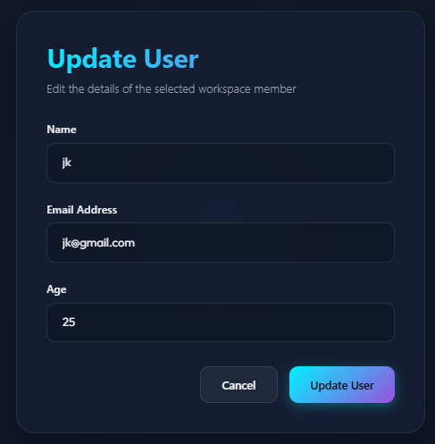

# Task 10: MERN Stack CRUD Integration Workspace

A full-stack user management system designed using the MERN stack (MongoDB, Express, React, Node.js). The application provides a responsive, premium user interface with a glassmorphism design aesthetic for managing registered members in a workspace.

## 🚀 Key Features

*   **Responsive Dashboard**: A premium, clean dashboard for managing members with responsive tables and clean hover animations.
*   **Full CRUD Integration**:
    *   **Create**: Add new workspace members with Name, Email, and Age inputs.
    *   **Read**: Real-time display of all active members.
    *   **Update**: Modify existing member profiles with data pre-populated in the form.
    *   **Delete**: Instantly delete workspace entries.
*   **Dual Mode Server Fallback**: Auto-detects environment connectivity. When run locally, it syncs with a MongoDB database via Express. When deployed to Vercel/production or if the local database server is offline, it safely falls back to a mock persistent database using `localStorage` so the website interface remains fully operational.

---

## 🛠️ Technology Stack

*   **Frontend**: React (Vite), React Router (HashRouter for URL path routing compatibility), Axios, CSS (Glassmorphism design language), and Bootstrap.
*   **Backend**: Node.js, Express.js.
*   **Database**: MongoDB, Mongoose ODM.

---

## 📸 Screenshots

### 1. Workspace Homepage
Displays the user grid list, action buttons, and empty-state handling.


### 2. Add User Form
Intuitive modal-like panel for adding a new user into the database.


### 3. Update User Form
Allows editing of details for any selected workspace member.


---

## ⚙️ Local Setup Instructions

### Prerequisites
*   Node.js (v18+)
*   MongoDB running locally (`mongodb://127.0.0.1:27017`)

### 1. Start the Backend Server
```bash
cd server
npm install
node index.js
```
The server will start running on `http://localhost:3001`.

### 2. Start the Frontend client
```bash
cd client
npm install
npm run dev
```
The client will launch locally at `http://localhost:5173`.
