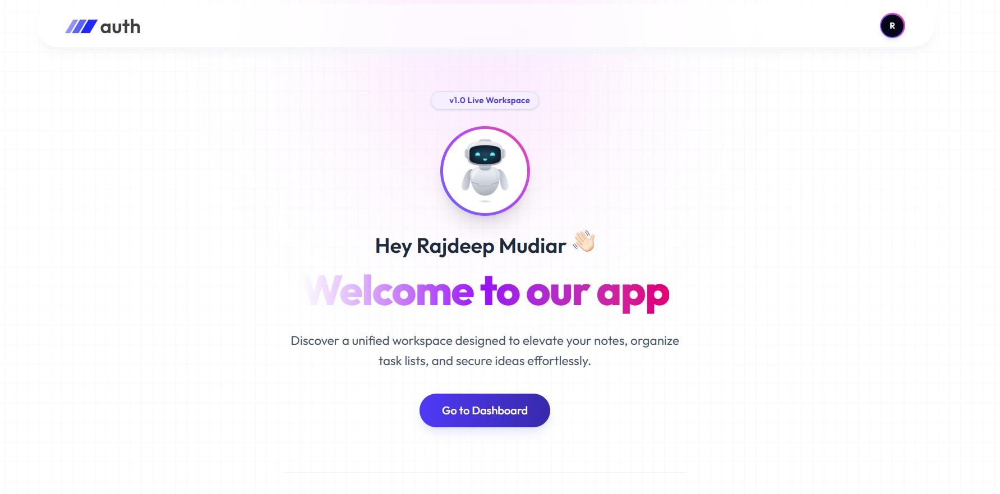
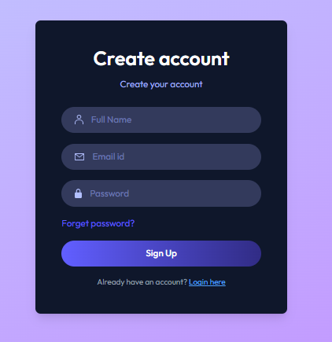
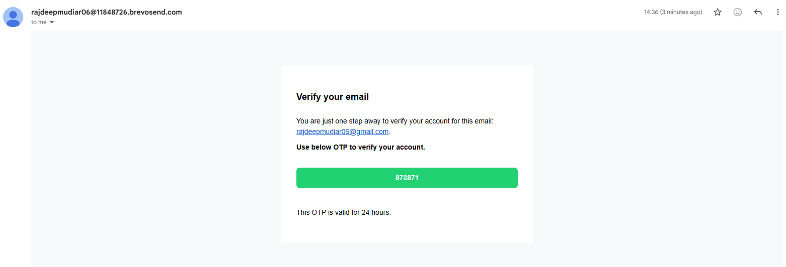
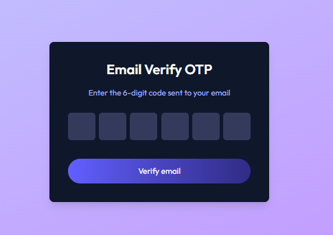
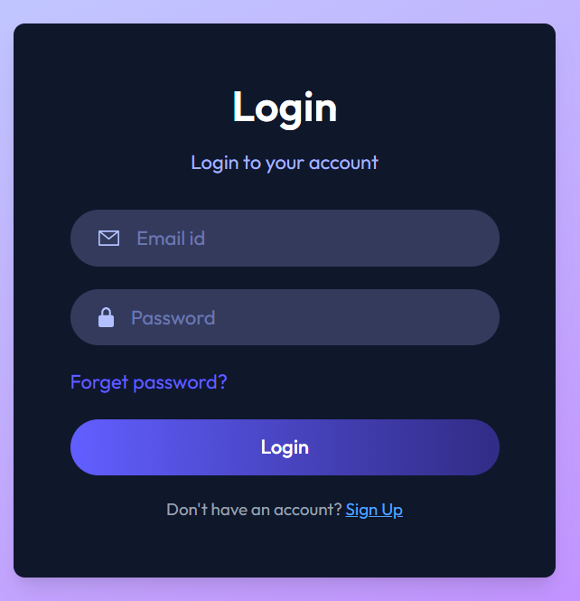
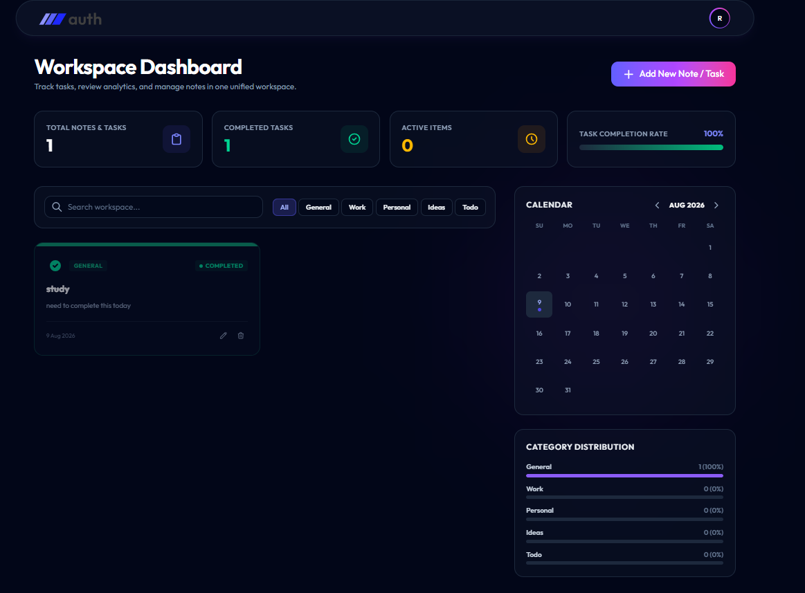
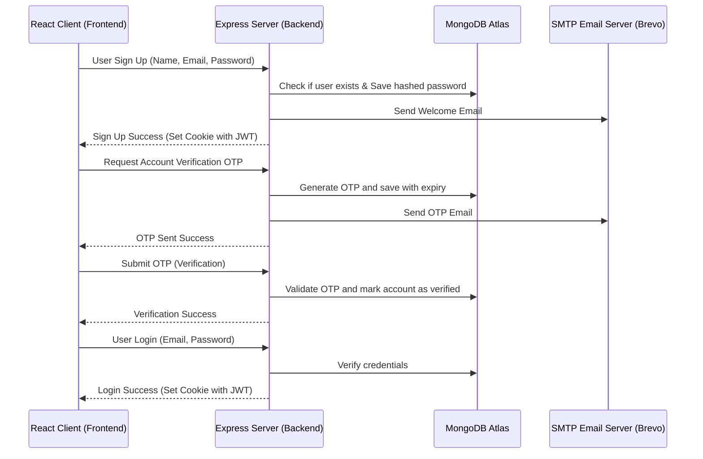

# Task 11 - MERN Authentication and CRUD Application

A full-stack MERN (MongoDB, Express, React, Node.js) authentication and CRUD application featuring secure email authentication (with OTP verification, password reset) and responsive styling using Tailwind CSS.

---

## Features and Walkthrough

### Home Page
The application features a modern, welcoming landing page that acts as the entry point. It displays information about the live workspace and has a Get Started button that routes the user to the login and registration pages.



### User Registration and Sign Up
Users can register by entering their name, email address, and a secure password. Upon submission, a new user account is created in the MongoDB database, and a welcome email is sent to their registered address.



### Email Authentication OTP
To secure user accounts, the system generates a 6-digit One-Time Password (OTP) and sends a formatted HTML email to the user's Gmail address using SMTP.



### Email Verification Flow
Once the user receives the OTP in their email, they enter it into the verification form on the website. This activates their account status in the database.



### User Login
Registered and verified users can securely log in using their email and password. The backend generates a secure JSON Web Token (JWT) which is stored in HTTP-only, secure, cross-site cookies.



### Protected User Dashboard
Upon successful authentication, users are redirected to their private dashboard. The dashboard is protected by authentication guards on both the frontend and backend, ensuring only logged-in users can view it.



---

## Architecture Flow

Below is the visual sequence flow showing how the React Client, Express Server, MongoDB Database, and SMTP Email service interact during key authentication actions:



---

## Project Structure

```text
Task_11_MERN_Auth_CRUD/
├── assets/                  # Screenshot assets
├── client/                  # Frontend Vite React App
│   ├── src/
│   │   ├── components/      # Reusable UI components
│   │   ├── context/         # AppContext for global auth state
│   │   ├── pages/           # Page routes (Home, Login, Verify, Reset)
│   │   └── App.jsx          # Route definitions
│   └── vite.config.js       # Vite configuration with relative path settings
└── server/                  # Backend Express Node.js Server
    ├── config/              # MongoDB and SMTP Mail transporter setup
    ├── controllers/         # Register, Login, Verification controller logic
    ├── middleware/          # User auth validation middleware
    ├── models/              # MongoDB Schema models (User schema)
    └── server.js            # Express API server entrypoint
```

---

## Setup and Installation

### Prerequisites
- Node.js installed on your machine
- MongoDB Atlas database connection string
- SMTP credentials (e.g., Brevo) for sending emails

### 1. Backend Server Setup
Navigate to the server directory:
```bash
cd server
```

Install the dependencies:
```bash
npm install
```

Create a .env file inside the server/ directory and configure the environment variables:
```env
MONGODB_URI = "your_mongodb_atlas_connection_string"
JWT_SECRET = "your_jwt_secret_key"
NODE_ENV = "development"
SMTP_USER = "your_smtp_username"
SMTP_PASS = "your_smtp_password"
SENDER_EMAIL = "your_sender_email@example.com"
PORT = 8000
```

Start the backend server using nodemon:
```bash
npm run server
```

---

### 2. Frontend Client Setup
Navigate to the client directory:
```bash
cd ../client
```

Install the dependencies:
```bash
npm install
```

Create a .env file inside the client/ directory and configure the backend URL:
```env
VITE_BACKEND_URL = "http://localhost:8000"
```

Start the local development server:
```bash
npm run dev
```

---

## Vercel Deployment Configuration

When deploying the frontend to Vercel, the application has been optimized to handle subdirectory deployments:
1. **Hash Routing**: Configured using HashRouter to prevent mismatched route paths in subdirectory environments.
2. **Relative Paths**: Configured with base: "./" in vite.config.js to ensure script and stylesheet assets resolve properly.
3. **Environment Variables**: Make sure to add VITE_BACKEND_URL under your Vercel project settings pointing to your live deployed backend URL.
